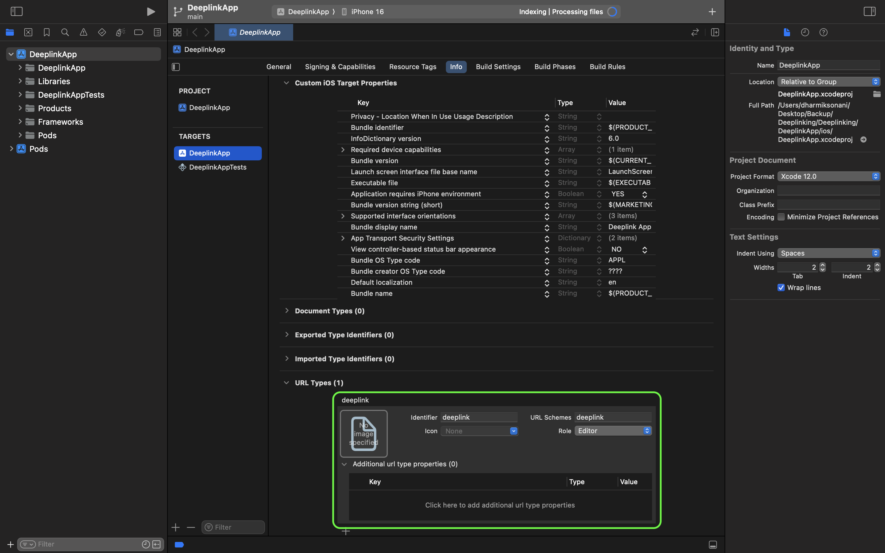

# Deeplink Setup for React Native - Node.js

## Frontend (React Native)

### 1. Android
#### File: [`android/app/src/main/AndroidManifest.xml`](https://github.com/DharmikSonani/Deeplinking-NodeJS/blob/main/DeeplinkApp/android/app/src/main/AndroidManifest.xml)
Add the following intent filter to your AndroidManifest.xml file:
```xml
<manifest>
  <application
    android:usesCleartextTraffic="true">

    <activity>
      <intent-filter android:autoVerify="true">
        <action android:name="android.intent.action.VIEW" />
        <category android:name="android.intent.category.DEFAULT" />
        <category android:name="android.intent.category.BROWSABLE" />
        <data android:scheme="http" />
        <data android:scheme="https" />
        <data android:host="localhost" /> <!-- Replace with your app domain, e.g., google.com -->
      </intent-filter>
    </activity>

  </application>
</manifest>
```

#### After changes must run below commands
  ```sh
  cd android
  ./gradlew clean
  cd ..
  npm run android
  ```

---

### 2. iOS
#### File: [`ios/DeeplinkApp/AppDelegate.mm`](https://github.com/DharmikSonani/Deeplinking-NodeJS/blob/main/DeeplinkApp/ios/DeeplinkApp/AppDelegate.mm)
Modify the `AppDelegate.mm` file to handle deep links:
```objc
#import "AppDelegate.h"
#import <React/RCTLinkingManager.h> // For DeepLinks

@implementation AppDelegate

- (BOOL)application:(UIApplication *)application
            openURL:(NSURL *)url
            options:(NSDictionary<UIApplicationOpenURLOptionsKey, id> *)options {
  return [RCTLinkingManager application:application openURL:url options:options];
}

- (BOOL)application:(UIApplication *)application
        continueUserActivity:(nonnull NSUserActivity *)userActivity
        restorationHandler:(nonnull void (^)(NSArray<id<UIUserActivityRestoring>> * _Nullable))restorationHandler {
  return [RCTLinkingManager application:application continueUserActivity:userActivity restorationHandler:restorationHandler];
}

- (BOOL)application:(UIApplication *)application
            openURL:(NSURL *)url
            sourceApplication:(NSString *)sourceApplication
            annotation:(id)annotation {
  return [RCTLinkingManager application:application openURL:url sourceApplication:sourceApplication annotation:annotation];
}

@end
```

#### Additional Resources:
- [**Internal Links Info**](./DeeplinkApp/ios-setup/Info.png)

  

- [**Universal Links Setup**](./DeeplinkApp/ios-setup/Signing%20&%20Capabilities.png)
  - ***Syntax***
    ```
    applinks:[domain]
    ```
    ```
    webcredentials:[domain]
    ```
  - ***Example***
    ```
    applinks:deeplinking-nodejs.vercel.app
    ```
    ```
    webcredentials:deeplinking-nodejs.vercel.app
    ```

  
  

#### After changes must run below commands
  ```sh
  cd ios
  pod install
  cd ..
  npm run ios
  ```
---

## Backend / Server (Node.js / Vercel)

### 1. Android
#### File: [`.well-known/assetlinks.json`](https://github.com/DharmikSonani/Deeplinking-NodeJS/blob/main/Deeplink-Server/.well-known/assetlinks.json)
Create the `assetlinks.json` file:
```json
[
  {
    "relation": ["delegate_permission/common.handle_all_urls"],
    "target": {
      "namespace": "android_app",
      "package_name": "[app-package-name]",
      "sha256_cert_fingerprints": []
    }
  }
]
```

#### Verify:
```
https://deeplinking-nodejs.vercel.app/.well-known/assetlinks.json
```
  - In this URL:
    - ***deeplinking-nodejs.vercel.app*** should be replaced with your ***domain or localhost*** depending on your environment.
  - Expected Result:
    ```json
    [
      {
        "relation": ["delegate_permission/common.handle_all_urls"],
        "target": {
          "namespace": "android_app",
          "package_name": "[app-package-name]",
          "sha256_cert_fingerprints": []
        }
      }
    ]
    ```

#### Notes:
- For websites (React JS), use `public/.well-known/assetlinks.json`.
- The **index.js** file and the **.well-known or public** directory are located in the same directory.

---

### 2. iOS
#### File: [`.well-known/apple-app-site-association`](https://github.com/DharmikSonani/Deeplinking-NodeJS/blob/main/Deeplink-Server/.well-known/apple-app-site-association)
Create the `apple-app-site-association` file:
```json
{
  "applinks": {
    "details": [
      {
        "appIDs": ["[team-id].[bundle-identifier]"],
        "components": [
          {
            "/": "/*",
            "comment": "Matches any URL with domain."
          }
        ]
      }
    ]
  },
  "webcredentials": {
    "apps": ["[team-id].[bundle-identifier]"]
  }
}
```

#### Verify:
```
https://deeplinking-nodejs.vercel.app/.well-known/apple-app-site-association
```
  - In this URL:
    - ***deeplinking-nodejs.vercel.app*** should be replaced with your ***domain or localhost*** depending on your environment.
  - Expected Result:
    - In many browsers, accessing this URL may either:
      - Automatically download the apple-app-site-association file, or
      - Display the JSON content directly.
    - Example apple-app-site-association File:
      ```json
      {
          "applinks": {
              "details": [
                  {
                      "appIDs": [ "[team-id].[bundle-identifier]" ],
                      "components": [
                          {
                              "/": "/*",
                              "comment": "Matches any URL with domain."
                          }
                      ]
                  }
              ]
          },
          "webcredentials": {
              "apps": [ "[team-id].[bundle-identifier]" ]
          }
      }
      ```

#### Notes:
- For websites (React JS), use `public/.well-known/apple-app-site-association`.
- The **index.js** file and the **.well-known or public** directory are located in the same directory.

---

### 3. Backend Server: [`index.js`](https://github.com/DharmikSonani/Deeplinking-NodeJS/blob/main/Deeplink-Server/index.js)
Set up a Node.js server to serve the `.well-known` files:
```javascript
const express = require('express');
const path = require('path');

const app = express();
const port = 3000;

// Serve .well-known/assetlinks.json
app.use('/.well-known', express.static(path.join(__dirname, '.well-known')));

// Default route
app.get('/', (req, res) => {
  res.send('Welcome to the Node.js server for App Links!');
});

// Start the server
app.listen(port, () => {
  console.log(`Server is running at http://localhost:${port}`);
});
```

---

## Testing

### 1. Android
#### Syntax:
```bash
adb shell am start -a android.intent.action.VIEW -c android.intent.category.BROWSABLE -d [deep-link]
```
#### Example:
```bash
adb shell am start -a android.intent.action.VIEW -c android.intent.category.BROWSABLE -d https://deeplinking-nodejs.vercel.app
```

### 2. iOS
#### Syntax:
```bash
xcrun simctl openurl booted [deep-link]
```
#### Example:
```bash
xcrun simctl openurl booted deeplink://localhost
```

